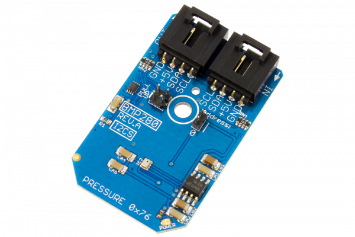

# Raspberry_pi__BMP280_Digital_Pressure_Sensor_Python_Library
[](https://store.ncd.io/product/bmp280-digital-pressure-sensor-300-1100-hpa-i2c-mini-module/).

# BMP280
BMP280 is a digital pressure Sensor.
This Device is available from www.ncd.io [SKU: BMP280_I2CS]
(https://store.ncd.io/product/bmp280-digital-pressure-sensor-300-1100-hpa-i2c-mini-module/)
This Sample code can be used with Raspberry Pi.

Hardware needed to interface BMP280 Digital Pressure Sensor With Raspberry Pi : 
1. <a href="https://store.ncd.io/product/mq-8-hydrogen-gas-sensor-adc121c-12-bit-adc-i2c-mini-module/">BMP280 Digital Pressure Sensor</a>
2.  <a href="https://store.ncd.io/product/i2c-shield-for-raspberry-pi-3-pi2-with-outward-facing-i2c-port-terminates-over-hdmi-port/">Raspberry Pi I2C Shield</a>
3. <a href="https://store.ncd.io/product/i%C2%B2c-cable/">I2C Cable</a>

## Python
Download and install smbus library on Raspberry pi. Steps to install smbus are provided at:
https://pypi.python.org/pypi/smbus-cffi/0.5.1
Download (or git pull) the code in pi. Run the program.

```cpp
$> python BMP280.py
```
The lib is a sample library, you will need to calibrate the sensor according to your application requirement.
